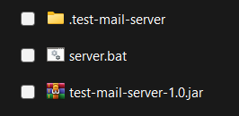
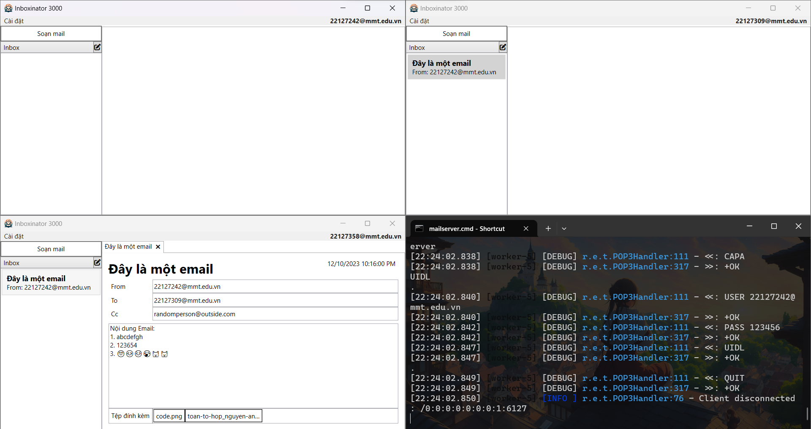

**ĐẠI HỌC QUỐC GIA THÀNH PHỐ HỒ CHÍ MINH**

**TRƯỜNG ĐẠI HỌC KHOA HỌC TỰ NHIÊN** 

**KHOA CÔNG NGHỆ THÔNG TIN** 

 

 

**ĐỒ ÁN TH1: SOCKET PROGRAMMING**

**CUỐN BÁO CÁO**

 

**\| Giảng viên giảng dạy \|**

**Chung Thùy Linh**

**Huỳnh Thụy Bảo Trân**

 

**\| Sinh viên \|**

**22127242 – Nguyễn Long**

**22127309 – Nguyễn Minh Nhật**

**22127358 – Phạm Văn Quyến**

 

**MÔN HỌC: MẠNG MÁY TÍNH**

THÀNH PHỐ HỒ CHÍ MINH 2023 

 

# Nội dung báo cáo

[**I.** **Giới thiệu** [2](#_Toc153140156)]

[**1.** **Giới thiệu chung** [2](#_Toc153140157)]

[**2.** **Mô tả đồ án** [2](#_Toc153140158)]

[**3.** **Thành viên nhóm** [2](#_Toc153140159)]

[**4.** **Tài nguyên liên kết** [2](#_Toc153140160)]

[**II.** **Đánh giá mức độ hoàn thành** [3](#_Toc153140161)]

[**1.** **Yêu cầu nội dung thực hiện** [3](#_Toc153140162)]

[**2.** **Đánh giá** [3](#_Toc153140163)]

[**III.** **Kịch bản giao tiếp của chương trình** [4](#_Toc153140164)]

[**1.** **Giao thức trao đổi giữa Client và Server** [4](#_Toc153140165)]

[**2.** **Cấu trúc thông điệp** [4](#_Toc153140166)]

[**3.** **Kiểu dữ liệu của thông điệp** [5](#_Toc153140167)]

[**4.** **Cách tổ chức cơ sở dữ liệu** [6](#_Toc153140168)]

[**IV.** **Môi trường lập trình và các framework hỗ trợ** [6](#_Toc153140169)]

[**1.** **Môi trường lập trình** [6](#_Toc153140170)]

[**2.** **Các framework hỗ trợ** [6](#_Toc153140171)]

[**V.** **Hướng dẫn sử dụng các tính năng chương trình** [6](#_Toc153140172)]

[**1.** **Khởi động chương trình** [6](#_Toc153140173)]

[**2.** **Đăng nhập và Autoload** [8](#_Toc153140174)]

[**3.** **Gửi và nhận email** [9](#_Toc153140175)]

[**4.** **Bộ lọc email** [15](#_Toc153140176)]

[**VI.** **Bảng phân chia công việc** [16](#_Toc153140177)]

[**VII.** **Các nguồn tài liệu tham khảo** [18](#_Toc153140178)]

1.  **Giới thiệu**

    1.  **Giới thiệu chung**

- Tên môn học: Mạng máy tính

- Mã môn học: CSC10008

- Đồ án: Project01 – Socket Programming

- Deadline: 12:00, 11/12/2023

- Hình thức: Bài tập nhóm

- Giảng viên phụ trách: Huỳnh Thụy Bảo Trân (Lý thuyết) 
                        Chung Thùy Linh (Thực hành)

1.  **Mô tả đồ án**

- Trong đồ án này, bạn sẽ viết chương trình Mail client, có thể có giao diện hoặc không có giao diện. Mail client kết nối đến Server để gửi email (SMTP) và lấy email trong mailbox (POP3).

  1.  **Thành viên nhóm**

<!-- -->

- Lớp: 22CLC05

- Danh sách thành viên:

| STT | MSSV     | Họ và tên        | Email                        | SĐT        |
|-----|----------|------------------|------------------------------|------------|
| 1   | 22127242 | Nguyễn Long      | <nlong22@clc.fitus.edu.vn>   | 0398279727 |
| 2   | 22127309 | Nguyễn Minh Nhật | <nmnhat22@clc.fitus.edu.vn>  | 0919999999 |
| 3   | 22127358 | Phạm Văn Quyến   | <pvquyen22@clc.fitus.edu.vn> | 0779599626 |

1.  **Tài nguyên liên kết**

- Link source: [longnguyen2004/HCMUS-EmailClient (github.com)](https://github.com/longnguyen2004/HCMUS-EmailClient)

1.  **Đánh giá mức độ hoàn thành**

    1.  **Yêu cầu nội dung thực hiện**

- Yêu cầu 1: Gửi được email (dùng giao thức SMTP): To, CC, BCC (lưu ý khi gửi BCC thì những người nhận liên quan (To, CC) sẽ không biết là có gửi BCC, vì khi đọc email sẽ không hiện user nào được BCC), gửi file đính kèm email.

- Yêu cầu 2: Tải được email từ Mail server (dùng giao thức POP3): Tải đủ và đúng. Không tải lại những email đã tải trước đó. Sinh viên tự đưa ra giải pháp để đảm bảo yêu cầu này cả khi tắt/ mở lại Mail Client.

- Yêu cầu 3: Cho phép người dùng phân loại email vào các folder cụ thể theo cấu hình của file config (phân loại theo địa chỉ người gửi, theo subject, hoặc từ khóa trong nội dung email). Mặc định email được tải về client luôn thuộc folder Inbox nếu không phù hợp bất kỳ kết quả filter nào.

- Yêu cầu 4: Cho phép lọc các từ khóa spam từ subject và nội dung email, di chuyển các spam email vào thư mục Spam khi lấy email về từ Mailbox của Server.

- Yêu cầu 5: Quản lý được trạng thái email (đã đọc/ chưa đọc). Sinh viên tự đưa ra giải pháp để đánh dấu, đảm bảo vẫn đúng khi tắt/mở chương trình Mail Client của mình.

- Yêu cầu 6: Nâng cao: Tự động tải email trong mailbox về mỗi 10s một lần, cấu hình thời gian tự động tải email này trong file config.

  1.  **Đánh giá**

| Yêu cầu | Mức độ hoàn thành | Những mục làm được | Những mục chưa làm được, bị lỗi |
|---------|-------------------|--------------------|---------------------------------|
| 1       | 100%              | Tất cả             | Không có                        |
| 2       | 100%              | Tất cả             | Không có                        |
| 3       | 100%              | Tất cả             | Không có                        |
| 4       | 100%              | Tất cả             | Không có                        |
| 5       | 100%              | Tất cả             | Không có                        |
| 6       | 100%              | Tất cả             | Không có                        |

*  
*

1.  **Kịch bản giao tiếp của chương trình**

    1.  **Giao thức trao đổi giữa Client và Server**

- Giao thức gửi mail: SMTP

- Giao thức nhận mail: POP3

  1.  **Cấu trúc thông điệp**

- SMTP

  - Request: Có những lệnh sau

    - HELO/EHLO: Bắt đầu giao tiếp với server

    - MAIL FROM:\<người gửi\>: Cài đặt người gửi

    - RCPT TO:\<người nhận\>: Thêm người nhận

    - DATA: Bắt đầu gửi nội dung email

    - RSET: Khôi phục trạng thái ban đầu

    - QUIT: Ngắt kết nối với server

  - Response: Có cấu trúc

    - \<mã response\>-\<thông tin bổ sung\>: Còn thông tin ở những dòng tiếp theo

    - \<mã response\> \<thông tin bổ sung\>: Không còn thông tin để đọc

  - Kịch bản giao tiếp minh họa:  
    C: \<client mở kết nối đến server\>  
    S: 220 \<thông tin server\>  
    C: EHLO  
    S: 250 \<lời chào server\>  
    C: MAIL FROM:\<a@gmail.com\>  
    S: 250 Ok  
    C: RCPT TO:\<b@gmail.com\>  
    S: 250 Ok  
    C: DATA  
    S: 354 End data with \<CR\>\<LF\>.\<CR\>\<LF\>  
    C: \<gửi nội dung email\>  
    C: .  
    S: 250 Ok  
    C: QUIT  
    S: 221 Bye

- POP3

  - Request: Có những lệnh sau

    - CAPA (multiline): Lấy thông tin về server

    - UIDL (multiline): Lấy danh sách email kèm ID

    - USER \<tên người dùng\>: Nhập tên người dùng

    - PASS \<mật khẩu\>: Nhập mật khẩu

    - STAT: Thông tin về số lượng email và dung lượng

    - LIST (multiline): Thông tin về số lượng email và dung lượng

    - RETR \<số thứ tự\> (multiline): Lấy email thứ \<số thứ tự\>

    - DELE \<số thứ tự\>: Đánh dấu xóa email thứ \<số thứ tự\>

    - NOOP: Không làm gì cả

    - RSET: Khôi phục lại trạng thái ban đầu

    - QUIT: Ngắt kết nối với server

  - Request: Có cấu trúc

    - +OK \<thông tin bổ sung\>: Lệnh thực thi thành công

    - -ERR \<thông tin bổ sung\>: Lệnh thực thi thất bại

    - Đối với những lệnh multiline: Sau +OK sẽ có nhiều dòng thông tin khác, kết thúc bởi 1 dòng có duy nhất dấu chấm.

  - Kịch bản giao tiếp minh họa  
    C: \<client mở kết nối đến server\>  
    S: +OK \<lời chào server\>  
    C: USER \<tên người dùng\>  
    S: +OK User accepted  
    C: PASS \<mật khẩu\>  
    S: +OK Pass accepted  
    C: CAPA  
    S: +OK  
    UIDL  
    .  
    C: UIDL  
    S: +OK  
    1 \<ID 1\>  
    2 \<ID 2\>  
    3 \<ID 3\>  
    .  
    C: RETR 1  
    S: +OK  
    \<nội dung email\>  
    .  
    C: QUIT  
    S: +OK

  1.  **Kiểu dữ liệu của thông điệp**

- Cấu trúc MIME có 2 phần, ngăn cách nhau bởi 1 dòng trống:

  - Header:

    - Cấu trúc header: \<key\>: \<value\>(; \<param1\>=\<value1\>; \<param2\>=\<value2\>;…)

    - Mỗi dòng có tối đa 998 kí tự

    - Nếu dòng sau là tiếp tục nội dung dòng trước, đầu dòng phải có ít nhất 1 dấu khoảng trắng

    - Bắt buộc:

      - Content-Type: Cho biết kiểu nội dung của phần MIME này

        - charset: Cho biết encoding của nội dung

        - boundary: Chuỗi phân cách giữa những phần MIME con, nếu là multipart

      - Content-Transfer-Encoding (bắt buộc nếu là tệp đính kèm hoặc charset không phải ASCII):  
        Cho biết cách chuyển đổi giữa nội dung trong phần MIME về encoding gốc

      - Content-Disposition: Cho biết nội dung là chữ hay tệp đính kèm, bắt buộc có giá trị là “attachment” nếu là tệp đính kèm

        - filename: Cho biết tên file gốc

    - Phần bổ sung dành cho email:

      - From: Người gửi email

      - To: Danh sách người nhận

      - Cc: Danh sách Cc

      - Bcc: Danh sách Bcc

      - Subject: Tiêu đề của email

      - Date: Ngày gửi email, theo định dạng RFC1123

      - Message-ID: ID của email

      - User-Agent (không bắt buộc): Định danh chương trình gửi email

  - Body:

    - Nếu không phải là multipart: Chứa nội dung của phần MIME này

    - Nếu là multipart: Chứa nhiều phần MIME con, theo định dạng dưới:  
      --{boundary}  
      \<phần MIME con 1\>  
      --{boundary}  
      \<phần MIME con 2\>  
      ...  
      --{boundary}  
      \<phần MIME con n\>  
      --{boundary}--

  1.  **Cách tổ chức cơ sở dữ liệu**

> Có 3 table trong cơ sở dữ liệu:

- emails: Chứa ID của email, nội dung email, trạng thái đã đọc

- filters: Chứa danh sách những thư mục

- EmailEntryFilter: Chứa liên kết giữa email và thư mục chứa email

2.  **Môi trường lập trình và các framework hỗ trợ**

    1.  **Môi trường lập trình**

- Ngôn ngữ lập trình: C#

- Nền tảng: .NET 8.0 trên Windows

  1.  **Các framework hỗ trợ**

- Xây dựng UI: Windows Presentation Foundation

- Cơ sở dữ liệu: SQLite + Entity Framework Core

3.  **Hướng dẫn sử dụng các tính năng chương trình**

    1.  **Khởi động chương trình**

- Để chương trình có thể hoạt động, bạn cần cài đặt **.NET Desktop Runtime 8.0**.  
  Link download: <https://dotnet.microsoft.com/en-us/download/dotnet/8.0>

- Đầu tiên, hãy mở **Test Mail Server** (SMTP port: *2225*, POP3 port: *3335*).  
  Nếu chưa có **Test Mail Server**, bạn có thể cài đặt ở đây.  
  Link download: <https://github.com/eugenehr/test-mail-server/releases/download/1.0/test-mail-server-1.0.jar>  
  Source code: <https://github.com/eugenehr/test-mail-server/>  
  Java 8 (JDK 8u361): <https://gist.github.com/wavezhang/ba8425f24a968ec9b2a8619d7c2d86a6>

- Bạn có thể tạo file **server.bat** để thuận tiện cho việc khởi động Server.

- Sau khi khởi động Server, ta tiếp tục chạy file thực thi **Inboxinator 3000.exe**. Chương trình đã được khởi động với 2 cửa sổ được hiện lên.  
  Phía trước là cửa sổ **Đăng nhập**, phía sau là cửa sổ chương trình **Inboxinator 3000**.

1.  **Đăng nhập và Autoload**

- Ở đây, bạn có thể đăng nhập bằng bất kì tài khoản nào vì server không xác thực tài khoản ở bước **Đăng nhập**.

- Về phần cấu hình SMTP và POP3, ở đây ta cần kết nối vào **Test Mail Server** đã khởi động trước đó (Host: *localhost*, SMTP port: *2225*, POP3 port: *3335*). Bạn có thể tạo host riêng để sử dụng chương trình giữa nhiều thiết bị, ở phần này chỉ để cập đến cách sử dụng chương trình ở cục bộ.

- Ngoài ra, ở đây bạn có thể thấy mục **Autoload**. Đây là thời gian để chương trình tự động tải email trong mailbox về, nếu để *mặc định là 0 giây* thì chương trình sẽ không tự động tải email về mà bạn phải thực hiện thủ công.

*Mật khẩu mặc định: 123456*

- Trong một phiên đăng nhập, bạn có thể đăng nhập vào 1 tài khoản để thực hiện gửi email. Sau đó, đăng xuất và đăng nhập vào tài khoản khác để xem email đã gửi trước đó. Tuy nhiên, để thuận tiện cho việc thao tác, bạn có thể nhân bản file thực thi và để chúng trong các folder riêng biệt để quan sát quá trình gửi/ nhận một cách rõ ràng.

- Chương trình sẽ ghi nhớ thông tin đăng nhập và cấu hình gần nhất, nên khi mở lại chương trình bạn không cần phải nhập lại nếu không thay đổi tài khoản.

- Sau khi **Đăng nhập**, folder *config* (chứa file *config.json*) và *message*s sẽ được tạo ra trong mỗi folder chứa chương trình tương ứng với từng tài khoản (Vì điều này nên bạn không thể chạy 1 file thực thi nhiều lần để đăng nhập vào nhiều tài khoản mà phải nhân bản chương trình ra nhiều folder).

- Phía trên là ví dụ về việc đăng nhập vào 3 tài khoản cùng lúc.

  1.  **Gửi và nhận email**

- Sau khi đăng nhập thành công, hãy bắt đầu gửi/nhận email giữa các tài khoản.

- Chọn **Soạn mail** \> Nhập địa chỉ người nhận bằng cách *ấn dấu +* bên cạnh các dòng To/ CC/ BCC hoặc *click 2 lần chuột phải* vào các ô \> **Thêm/ Xóa**.

> 
>
> 
>
> 

- Tiếp theo hãy nhập *Subject* và *nội dung* thư gửi. Để đính kèm file khi gửi, hãy ấn dấu + ở mục *Tệp đính kèm* và chọn file muốn gửi

> 
>
>   
>   
> 
>
> \* Khi gửi mail có dung lượng quá 3MB, thông báo lỗi sẽ hiện ra:  
> 

- Sau khi soạn mail, ấn **Gửi** để gửi mail.  
  

- Nhận email

  - Chức năng nhận email tự động được cái đặt trong cửa sổ đăng nhập; người dùng cũng có thể làm mới hộp thư thủ công bằng **Cài đặt Làm mới** ở góc trái trên chương trình:

  - Sau khi làm mới, email sẽ xuất hiện ở danh sách bên trái chương trình, click vào mail cần đọc để mở.  
    

  - Email đã đọc sẽ được hiển thị với màu sắc khác:  
    

  - Để tải tệp đính kèm, nháy đúp chuột (double click) tệp tin cần lưu trữ; chọn vị trí lưu và chọn **Save  
    **

> **  
> **

- Chọn **Cài đặt Đăng xuất** để kết thúc phiên sử dụng.

  1.  **Bộ lọc email**

<!-- -->

- Tại màn hình chính, bấm vào nút sau đây để mở hộp thoại quản lý bộ lọc

- Bắt đầu cài đặt bộ lọc:

  - Loại bộ lọc: Dựa theo người gửi, tiêu đề, nội dung, tiêu đề + nội dung

  - Từ khóa: Những từ khóa cần lọc

  - Thư mục: Thư mục để chuyển email khớp với bộ lọc vào

- Đóng cửa sổ. Những email trong danh sách sẽ được tự động lọc lại

4.  **Bảng phân chia công việc**

<table>
<colgroup>
<col style="width: 6%" />
<col style="width: 31%" />
<col style="width: 6%" />
<col style="width: 26%" />
<col style="width: 29%" />
</colgroup>
<thead>
<tr class="header">
<th>STT</th>
<th>Yêu cầu</th>
<th>Điểm</th>
<th>File/ Module</th>
<th>Người thực hiện</th>
</tr>
</thead>
<tbody>
<tr class="odd">
<td rowspan="4">1</td>
<td rowspan="4">
Gửi được Email với TO và CC

<ul>
<li>
Gửi email đến một hoặc nhiều địa chỉ người nhận (TO) <strong>0,5đ</strong>
</li>
<li>
Gửi email đến một hoặc nhiều địa chỉ người nhận (CC) <strong>0,5đ</strong>
</li>
</ul></td>
<td rowspan="4">1</td>
<td>.Core.Email</td>
<td>Nguyễn Long</td>
</tr>
<tr class="even">
<td>.Core.Mime</td>
<td>Nguyễn Long</td>
</tr>
<tr class="odd">
<td>.Core.SmtpClient</td>
<td>Phạm Văn Quyến</td>
</tr>
<tr class="even">
<td>.Gui.View.EmailComposer</td>
<td>Nguyễn Long 
Nguyễn Minh Nhật</td>
</tr>
<tr class="odd">
<td>2</td>
<td>Gửi được Email với BCC</td>
<td>0,5</td>
<td>Như mục 1</td>
<td></td>
</tr>
<tr class="even">
<td>3</td>
<td>
Gửi được attached file ( dung lượng file  &lt;= 3MB)

<ul>
<li>
Gửi được file *.txt: <strong>0,5đ</strong>
</li>
<li>
Gửi được các định dạng file như: *.docx, *.pdf, *.jpg, *.zip,... <strong>1đ</strong>
</li>
<li>
Gửi được nhiều file đính kèm trong cùng 1 email <strong>0,5đ</strong>
</li>
<li>
Có giới hạn dung lượng file gửi: <strong>0,5đ</strong>
</li>
</ul></td>
<td>2 (max)</td>
<td>Như mục 1</td>
<td></td>
</tr>
<tr class="odd">
<td rowspan="6">4</td>
<td rowspan="6">
Tải được các email về mail client từ mailbox của Server

<ul>
<li>
Tải nội dung email không kèm file <strong>1đ</strong>
</li>
<li>
Tải nội dung email có kèm file <strong>1,5đ</strong>
</li>
<li>
Tải nội dung email có kèm file, có lưu file xuống máy cục bộ của client <strong>2đ</strong>
</li>
</ul></td>
<td rowspan="6">2 (max)</td>
<td>.Core.Email</td>
<td>Nguyễn Long</td>
</tr>
<tr class="even">
<td>.Core.Mime</td>
<td>Nguyễn Long</td>
</tr>
<tr class="odd">
<td>.Core.Pop3Client</td>
<td>Nguyễn Minh Nhật</td>
</tr>
<tr class="even">
<td>.Database</td>
<td>Nguyễn Long</td>
</tr>
<tr class="odd">
<td>.Gui.View.EmailViewer</td>
<td>Nguyễn Long 
Nguyễn Minh Nhật</td>
</tr>
<tr class="even">
<td>.Gui.ViewModel.EmailList</td>
<td>Nguyễn Long 
Nguyễn Minh Nhật</td>
</tr>
<tr class="odd">
<td rowspan="2">5</td>
<td rowspan="2">Quản lý trạng thái email (đã đọc/ chưa đọc)</td>
<td rowspan="2">0,5</td>
<td>.Gui.MainWindow</td>
<td>
Nguyễn Long 
Nguyễn Minh Nhật

Phạm Văn Quyến
</td>
</tr>
<tr class="even">
<td>.Database</td>
<td>Nguyễn Long</td>
</tr>
<tr class="odd">
<td rowspan="3">6</td>
<td rowspan="3">
Xử lý lọc email:

<ul>
<li>
Lọc email dựa trên địa chỉ người gửi <strong>0,5đ</strong>
</li>
<li>
Lọc email dựa trên subject <strong>0,25đ</strong>
</li>
<li>
Lọc email dựa trên nội dung <strong>0,25đ</strong>
</li>
<li>
Di chuyển email vào thư mục cụ thể/ Spam <strong>0,5đ</strong>
</li>
</ul></td>
<td rowspan="3">1,5 (max)</td>
<td>.Gui.EmailFilter</td>
<td>Nguyễn Long</td>
</tr>
<tr class="even">
<td>.Database</td>
<td>Nguyễn Long</td>
</tr>
<tr class="odd">
<td>.Gui.Dialog.FilterManager</td>
<td>Nguyễn Long 
Nguyễn Minh Nhật</td>
</tr>
<tr class="even">
<td>7</td>
<td>Xử lý tự động tải email từ Mailbox theo thời gian cấu hình trong config file</td>
<td>1</td>
<td>.Gui.MainWindow</td>
<td>Nguyễn Long</td>
</tr>
<tr class="odd">
<td rowspan="2">8</td>
<td rowspan="2">
Tổ chức file config:

<ul>
<li>
Không tổ chức file config: <strong>0đ</strong>
</li>
<li>
Có sử dụng file config dạng *.txt <strong>0,5đ</strong>
</li>
<li>
Có sử dụng file config dạng file có cấu trúc (*.xml, *.sql, *.json,...) <strong>1đ</strong>
</li>
</ul></td>
<td rowspan="2">1 (max)</td>
<td>.Gui.Configuration</td>
<td>Phạm Văn Quyến</td>
</tr>
<tr class="even">
<td>.Gui.MainWindow</td>
<td>Nguyễn Long</td>
</tr>
<tr class="odd">
<td>9</td>
<td>Báo cáo</td>
<td>0,5</td>
<td>Report.pdf</td>
<td>Phạm Văn Quyến</td>
</tr>
</tbody>
</table>

5.  **Các nguồn tài liệu tham khảo**

[RFC 2045 - Multipurpose Internet Mail Extensions (MIME) Part One: Format of Internet Message Bodies (ietf.org)](https://datatracker.ietf.org/doc/html/rfc2045)

[RFC 2047 - MIME (Multipurpose Internet Mail Extensions) Part Three: Message Header Extensions for Non-ASCII Text (ietf.org)](https://datatracker.ietf.org/doc/html/rfc2047)

[RFC 5322 - Internet Message Format (ietf.org)](https://datatracker.ietf.org/doc/html/rfc5322)

[RFC 5321 - Simple Mail Transfer Protocol (ietf.org)](https://datatracker.ietf.org/doc/html/rfc5321)

[RFC 1939 - Post Office Protocol - Version 3 (ietf.org)](https://datatracker.ietf.org/doc/html/rfc1939)

[.NET API browser \| Microsoft Learn](https://learn.microsoft.com/en-us/dotnet/api/?view=net-8.0)

[Windows Presentation Foundation for .NET 7 documentation \| Microsoft Learn](https://learn.microsoft.com/en-us/dotnet/desktop/wpf/?view=netdesktop-8.0)

[Overview of Entity Framework Core - EF Core \| Microsoft Learn](https://learn.microsoft.com/en-us/ef/core/)

[Asynchronous programming in C# - C# \| Microsoft Learn](https://learn.microsoft.com/en-us/dotnet/csharp/asynchronous-programming/)

[MIME - Wikipedia](https://en.wikipedia.org/wiki/MIME)

[Simple Mail Transfer Protocol - Wikipedia](https://en.wikipedia.org/wiki/Simple_Mail_Transfer_Protocol)

[Post Office Protocol - Wikipedia](https://en.wikipedia.org/wiki/Post_Office_Protocol)
